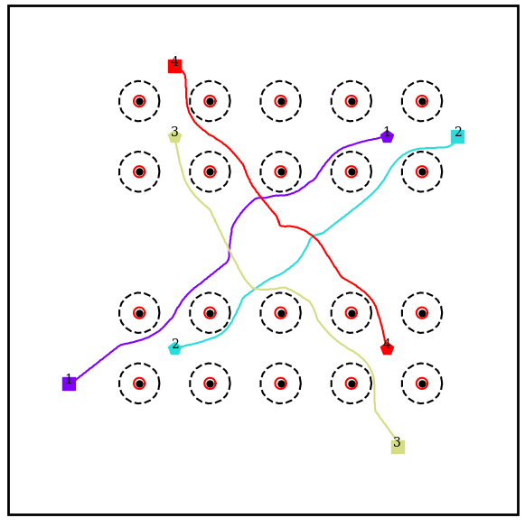
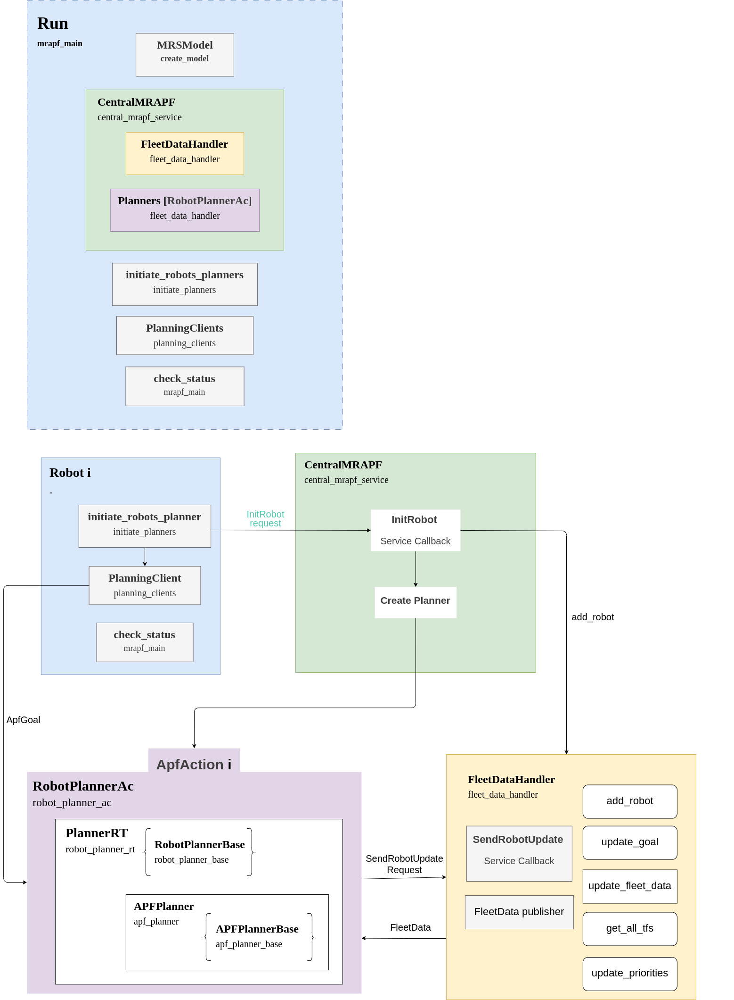
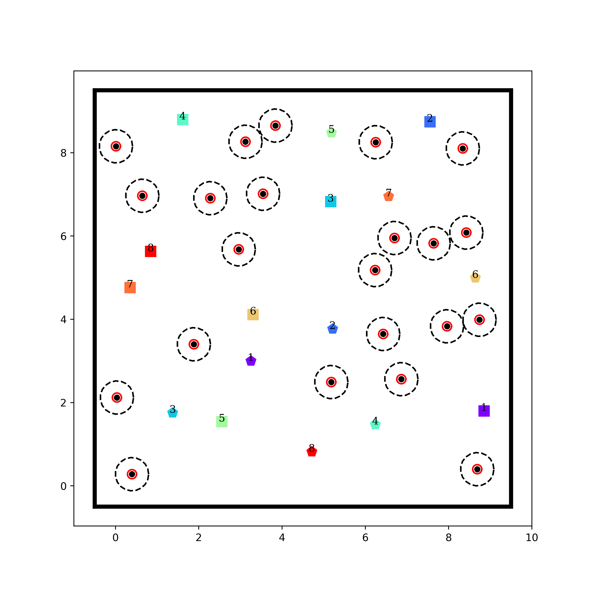

# MR-APF: Multi-Robot Artificial Potential Fields Path Planning

A ROS-based implementation for distributed multi-robot path planning using Artificial Potential Fields (APF) for real-time navigation and obstacle avoidance. Features adaptive and multi-robot convergence avoidance potential fields for improved planning.

## Overview

This project provides a multi-robot APF path planning system, enabling multiple robots to autonomously navigate while avoiding obstacles and each other. It supports both real-time Gazebo simulation and lightweight point-robot simulation with RViz visualization.

Key improvements include:

- Adaptive obstacle avoidance potentials
- Adaptive inter-robot collision avoidance
- New convergence avoidance potentials to prevent robot clustering

<table style="padding:10px">
  <tr>
    <td></td>
    <td></td>
  </tr>
</table>

<!-- 
 -->

<!-- <video width="400" height="400" controls>
  <source src="results/media/mrapf-m2.mp4" type="video/mp4">
</video> -->


## Features

- **Distributed Planning**: Each robot runs its own planner, sharing fleet data
- **Real-time Visualization**: Live monitoring in RViz
- **Dual Simulation Modes**: Choose between Gazebo (realistic physics) or point-robot simulation (fast, scalable)
- **Dynamic Obstacle Avoidance**: Handles moving obstacles and inter-robot collisions
- **Fleet Coordination**: Centralized data management with distributed execution
- **Result Analysis**: Automatic path recording and visualization

## System Architecture



The system includes:

- **Central MRAPF Service**: Coordinates fleet data and robot initialization
- **Robot Planners**: Individual APF-based planners for each robot
- **Fleet Data Handler**: Manages robot positions and states
- **Visualization System**: Real-time RViz monitoring

## Simulation Modes

Set the mode in the parameters file.

### 1. Real-time Gazebo Simulation

- Full physics simulation with TurtleBot3 models
- Realistic sensor data and robot dynamics

### 2. Simple Point-Robot Simulation

- Lightweight, fast simulation for algorithm testing
- Robots modeled as circular agents
- Scalable to large fleets

Both modes offer:

- Real-time RViz visualization
- Path recording and analysis
- Performance metrics collection

## Sample Environment



## Installation

1. Clone the repository into your ROS workspace:

  ```bash
  cd ~/catkin_ws/src
  git clone https://github.com/MortezaHagh/mr_apf.git
  ```

2. Build the package:

  ```bash
  cd ~/catkin_ws
  catkin_make
  source devel/setup.bash
  ```

## Usage

### Quick Start

Wait a few seconds after runnign the nodes.

```bash
# For multi robot path planning in Gazebo simulation with TurtleBot3
roslaunch apf run_mrapf.launch

# for multi robot path planning - Simple Point-Robot Simulation
roslaunch apf point_sim.launch
```

### Configuration

- Edit `scripts/parameters.py` for algorithm parameters
- Modify launch files for robot configurations
- Adjust map files in `model_inputs.py`

## Project Structure

```bash
mr_apf/
├── action/          # ROS action definitions
├── design/          # Architecture diagrams and docs
├── launch/          # ROS launch files
├── maps/            # Environment maps (JSON, PNG, SVG)
├── models/          # Robot and obstacle models
├── msg/             # ROS message definitions
├── results/         # Simulation results and analysis
├── rviz/            # RViz configuration files
├── scripts/         # Core Python implementation
│   ├── apf_planner_*.py    # APF algorithm implementations
│   ├── mrapf_main.py       # Main simulation entry point
│   ├── visualization.py    # RViz visualization
│   └── ...
└── srv/             # ROS service definitions
```

## Key Components

- **APF Planners**: Core artificial potential field algorithms
- **Fleet Management**: Centralized coordination system
- **Visualization**: Real-time RViz display
- **Model Creation**: Environment and robot model generation
- **Results Analysis**: Path and performance metrics

## Results

Simulation results are saved in the `results/` directory, including:

- Robot trajectories and paths
- Performance metrics
- Visualization plots
- JSON data for further analysis

## License

This project is licensed under the MIT License. See the LICENSE file for details.

## Citation

If you use this work in your research, please cite:

[Paper Link](https://ieeexplore.ieee.org/document/11163011)


```bibtex
@inproceedings{haghbeigi2025adaptive,
  title={Adaptive Potential Fields for Multi-Robot Path Planning with Convergence Avoidance},
  author={Haghbeigi, Morteza and Ordys, Andrzej},
  booktitle={2025 European Conference on Mobile Robots (ECMR)},
  pages={1--6},
  year={2025},
  organization={IEEE},
  doi={10.1109/ECMR65884.2025.11163011}}
}
```
